# Microservice Design theo DDD cho CAB SYSTEM

> **Mục tiêu tài liệu:** Phân rã hệ thống CAB theo Domain-Driven Design (DDD), xác định Bounded Context, Ubiquitous Language, Microservice, API, ERD, lựa chọn database và script khởi tạo CSDL cho từng Microservice.

---

## Mục lục

1. [Cơ sở thiết kế](#1-cơ-sở-thiết-kế)
2. [Business Process Model của CAB](#2-business-process-model-của-cab)
3. [Phân rã Bounded Context](#3-phân-rã-bounded-context)
4. [Context Map và luồng tích hợp](#4-context-map-và-luồng-tích-hợp)
5. [Ubiquitous Language](#5-ubiquitous-language)
6. [Thiết kế Microservice và API](#6-thiết-kế-microservice-và-api)
7. [ERD và Database cho từng Microservice](#7-erd-và-database-cho-từng-microservice)
8. [Xây dựng CSDL cho từng Microservice](#8-xây-dựng-csdl-cho-từng-microservice)
9. [Domain Event giữa các Microservice](#9-domain-event-giữa-các-microservice)
10. [Traceability FR → Bounded Context → Microservice](#10-traceability-fr--bounded-context--microservice)
11. [Đề xuất cấu trúc source code](#11-đề-xuất-cấu-trúc-source-code)
12. [Kết luận](#12-kết-luận)

---

# 1. Cơ sở thiết kế

## 1.1. Business Problem

Hệ thống CAB được xây dựng để giải quyết các vấn đề chính:

- Tự động tìm và phân công tài xế thay vì điều phối thủ công.
- Theo dõi chuyến đi theo thời gian thực.
- Quản lý thanh toán tập trung và tích hợp cổng thanh toán bên ngoài.
- Cho phép từng thành phần mở rộng độc lập khi tải tăng.
- Cô lập lỗi giữa đặt xe, thanh toán, thông báo và các chức năng khác.
- Cung cấp dữ liệu vận hành và báo cáo cho nhân viên vận hành/Ban lãnh đạo.
- Đảm bảo xác thực, phân quyền và lưu vết thao tác quan trọng.

## 1.2. Nguyên tắc phân rã DDD

Tài liệu này áp dụng các nguyên tắc:

1. **Một Bounded Context có một mô hình nghiệp vụ riêng.**
2. **Mỗi Bounded Context được triển khai thành một Microservice chính.**
3. **Mỗi Microservice sở hữu database riêng — Database per Service.**
4. Không tạo Foreign Key trực tiếp giữa database của hai Microservice.
5. Khi cần tham chiếu dữ liệu của service khác chỉ lưu `ID` như một giá trị tham chiếu.
6. Giao tiếp đồng bộ dùng REST API khi cần phản hồi ngay.
7. Giao tiếp bất đồng bộ ưu tiên Domain Event qua Message Broker.
8. Các dữ liệu quan hệ chặt, cần transaction → **PostgreSQL**.
9. Dữ liệu document/read-model, khối lượng đọc lớn, schema linh hoạt → **MongoDB**.
10. Dữ liệu thời gian thực, tồn tại ngắn, cần truy xuất cực nhanh → **Redis**.

## 1.3. Quy ước quan trọng

- `customer_id`, `driver_id`, `trip_id`... giữa các service **không phải FK vật lý xuyên database**.
- Một service không được đọc thẳng database của service khác.
- Admin Portal không sở hữu bản sao "master" của Customer/Driver; nó gọi đúng service sở hữu dữ liệu.
- Reporting dùng read model riêng, được cập nhật bằng event để không làm chậm transaction nghiệp vụ.
- Dispatching không lưu hồ sơ tài xế lâu dài; nó chỉ giữ trạng thái online, vị trí và phiên điều phối đang hoạt động.

---

# 2. Business Process Model của CAB

Business Process của hệ thống gồm 11 bước:

| Bước | Workflow | Ý nghĩa |
|---|---|---|
| BP-01 | Create Booking | Khách hàng nhập điểm đón, điểm đến, loại xe và tạo yêu cầu |
| BP-02 | Find Driver | Hệ thống tìm tài xế phù hợp |
| BP-03 | Accept / Reject | Tài xế nhận đề nghị và chấp nhận/từ chối |
| BP-04 | Assign Driver | Gán tài xế hoặc tiếp tục tìm tài xế khác |
| BP-05 | Pickup Customer | Tài xế đến điểm đón |
| BP-06 | Execute Trip | Đón khách và thực hiện chuyến |
| BP-07 | Complete Trip | Tài xế kết thúc chuyến |
| BP-08 | Calculate Fare | Hệ thống tính cước cuối cùng |
| BP-09 | Payment | Khách hàng thanh toán |
| BP-10 | Rating | Khách hàng đánh giá tài xế |
| BP-11 | Record & Report | Lưu lịch sử, tổng hợp vận hành và báo cáo |

---

# 3. Phân rã Bounded Context

Đề xuất **10 Bounded Context**.

| # | Bounded Context | Microservice | FR chính | Business Process phục vụ | Database |
|---|---|---|---|---|---|
| BC-01 | Identity & Access | `identity-service` | FR-CUS-01, FR-DRV-01, FR-ADM-04 | Điều kiện trước của toàn bộ workflow | PostgreSQL |
| BC-02 | Customer Management | `customer-service` | FR-CUS-02, phần Customer của FR-ADM-01 | BP-01, BP-10, BP-11 | PostgreSQL |
| BC-03 | Driver & Vehicle Management | `driver-service` | FR-DRV-01, phần Driver/Vehicle của FR-ADM-01 | BP-02 → BP-07, BP-11 | PostgreSQL |
| BC-04 | Trip Management | `trip-service` | FR-CUS-03, FR-CUS-05, FR-CUS-07, FR-DRV-04, phần FR-ADM-02 | BP-01, BP-04 → BP-07, BP-11 | PostgreSQL |
| BC-05 | Dispatch & Realtime Location | `dispatch-service` | FR-DRV-02, FR-DRV-03, FR-DRV-05, FR-SYS-01, FR-SYS-02, FR-SYS-03, phần realtime của FR-CUS-05 | BP-02, BP-03, BP-04 | Redis |
| BC-06 | Pricing | `pricing-service` | FR-CUS-04, FR-SYS-04 | BP-01, BP-08 | PostgreSQL |
| BC-07 | Payment | `payment-service` | FR-CUS-06, FR-SYS-05, phần FR-ADM-03 | BP-09, BP-11 | PostgreSQL |
| BC-08 | Notification | `notification-service` | FR-SYS-06 | BP-01, BP-03, BP-04, BP-05, BP-07, BP-09 | MongoDB |
| BC-09 | Review & Rating | `review-service` | FR-CUS-08 | BP-10, BP-11 | PostgreSQL |
| BC-10 | Operations, Audit & Reporting | `operations-service` | FR-ADM-02, FR-ADM-03, FR-ADM-05, FR-ADM-06 | Giám sát BP-02 → BP-09 và BP-11 | MongoDB |

## 3.1. Vì sao phân rã như vậy?

### Identity tách khỏi Customer/Driver

Thông tin đăng nhập, password hash, role và quyền truy cập là một mô hình khác với hồ sơ nghiệp vụ. Một tài khoản có thể đại diện Customer, Driver hoặc Admin.

### Driver Profile tách khỏi Dispatch

`driver-service` lưu dữ liệu dài hạn như:

- hồ sơ tài xế;
- GPLX;
- phương tiện;
- trạng thái duyệt.

`dispatch-service` chỉ lưu dữ liệu vận hành ngắn hạn:

- Online/Offline;
- vị trí GPS hiện tại;
- candidate list;
- offer 15 giây;
- khóa chống hai tài xế nhận cùng một chuyến.

### Trip tách khỏi Dispatch

Trip là Aggregate lâu dài, có lịch sử trạng thái và cần transaction. Dispatch là xử lý real-time, tốc độ cao và có nhiều dữ liệu hết hạn.

### Pricing tách khỏi Payment

Pricing trả lời câu hỏi **"chuyến này giá bao nhiêu?"**.  
Payment trả lời câu hỏi **"số tiền đó đã được thanh toán chưa?"**.

### Operations/Reporting không sở hữu dữ liệu nghiệp vụ gốc

Service này xây dựng **read model** từ event của các service khác để:

- dashboard;
- tìm kiếm nhanh;
- báo cáo;
- audit log.

---

# 4. Context Map và luồng tích hợp

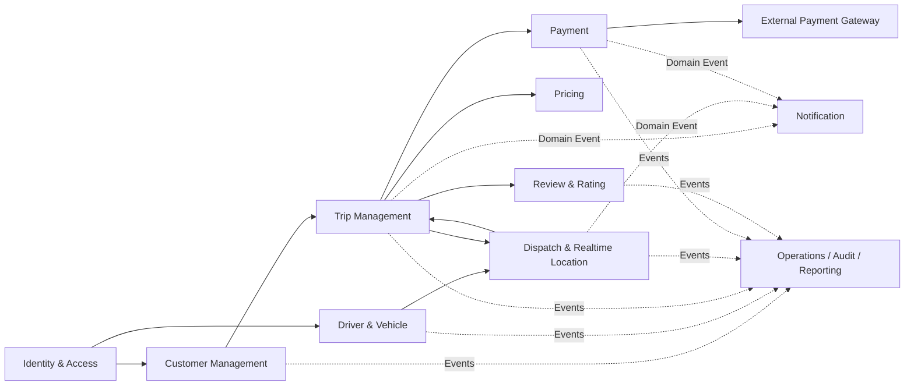

## 4.1. Kiểu quan hệ giữa các Context

| Upstream | Downstream | Kiểu tích hợp | Dữ liệu |
|---|---|---|---|
| Identity | Customer / Driver / Admin UI | REST/JWT | user identity, role |
| Driver | Dispatch | Event + REST | driver được duyệt, vehicle type |
| Trip | Pricing | REST | pickup/dropoff, vehicle type, trip metrics |
| Trip | Dispatch | REST + Event | yêu cầu tìm tài xế |
| Dispatch | Trip | Event/REST command | tài xế được gán |
| Trip | Payment | Event/REST | trip completed, final fare |
| Payment | External Gateway | REST/Webhook | electronic transaction |
| Trip/Dispatch/Payment | Notification | Event | notification trigger |
| All domain services | Operations | Event | read model + audit/report |

---

# 5. Ubiquitous Language

## 5.1. BC-01 — Identity & Access

| Thuật ngữ | Định nghĩa thống nhất |
|---|---|
| Account | Tài khoản dùng để xác thực vào hệ thống |
| Credential | Thông tin xác thực như password hash, OTP |
| Role | Nhóm quyền: CUSTOMER, DRIVER, OPERATOR, SUPER_ADMIN |
| Permission | Quyền chi tiết thực hiện một hành động |
| Authentication | Xác minh người dùng là ai |
| Authorization | Kiểm tra người dùng được phép làm gì |
| Access Token | Token ngắn hạn dùng gọi API |
| Refresh Token | Token dùng cấp lại Access Token |

## 5.2. BC-02 — Customer Management

| Thuật ngữ | Định nghĩa |
|---|---|
| Customer | Người sử dụng dịch vụ đặt xe |
| Customer Profile | Hồ sơ nghiệp vụ của khách hàng |
| Active Customer | Khách hàng đang được phép sử dụng hệ thống |
| Banned Customer | Khách hàng bị khóa ở cấp nghiệp vụ |
| Contact Information | Tên, SĐT, email dùng cho hồ sơ |
| Customer Reference | `customer_id` được dùng bởi Trip/Review |

## 5.3. BC-03 — Driver & Vehicle Management

| Thuật ngữ | Định nghĩa |
|---|---|
| Driver | Tài xế thực hiện chuyến đi |
| Driver Profile | Hồ sơ nghiệp vụ của tài xế |
| Driver Approval | Kết quả duyệt tài xế |
| Vehicle | Phương tiện tài xế đăng ký |
| Vehicle Type | BIKE, CAR_4, CAR_7... |
| License Plate | Biển số phương tiện |
| Approved Vehicle | Xe đủ điều kiện tham gia vận hành |
| Driver Eligibility | Điều kiện tài xế được phép chuyển sang Online |

## 5.4. BC-04 — Trip Management

| Thuật ngữ | Định nghĩa |
|---|---|
| Trip | Aggregate đại diện một yêu cầu/chuyến đi |
| Pickup | Điểm đón |
| Dropoff | Điểm đến |
| Trip Status | Trạng thái vòng đời chuyến |
| Finding | Đang tìm tài xế |
| Assigned | Đã gán tài xế |
| Arrived | Tài xế đã đến điểm đón |
| In Progress | Khách đã lên xe và chuyến đang thực hiện |
| Completed | Chuyến đã hoàn thành |
| Cancelled | Chuyến đã hủy |
| Trip Status History | Nhật ký thay đổi trạng thái chuyến |
| Assigned Driver | Tài xế hiện tại của Trip |

## 5.5. BC-05 — Dispatch & Realtime Location

| Thuật ngữ | Định nghĩa |
|---|---|
| Driver Presence | Trạng thái online thực tế của tài xế |
| Available Driver | Tài xế online, đủ điều kiện và chưa có chuyến |
| Driver Location | Tọa độ GPS mới nhất |
| Dispatch Request | Yêu cầu tìm tài xế cho một Trip |
| Candidate Driver | Tài xế có thể được mời nhận chuyến |
| Driver Offer | Lời mời nhận chuyến gửi cho một tài xế |
| Offer Timeout | Thời gian tối đa tài xế phản hồi |
| Reject | Tài xế từ chối offer |
| Accept | Tài xế nhận offer |
| Assignment Lock | Khóa nguyên tử đảm bảo chỉ một tài xế thắng |

## 5.6. BC-06 — Pricing

| Thuật ngữ | Định nghĩa |
|---|---|
| Fare Quote | Giá dự kiến trước khi đặt xe |
| Fare Rule | Quy tắc/cấu hình tính giá |
| Base Fare | Giá mở cửa |
| Distance Fare | Thành phần giá theo quãng đường |
| Time Fare | Thành phần giá theo thời gian |
| Surge | Hệ số giá theo nhu cầu, nếu có |
| Final Fare | Cước cuối cùng sau khi Trip Completed |

## 5.7. BC-07 — Payment

| Thuật ngữ | Định nghĩa |
|---|---|
| Payment | Aggregate đại diện việc thanh toán cho Trip |
| Payment Method | CASH, E_WALLET, CARD |
| Payment Status | PENDING, PROCESSING, SUCCESS, FAILED |
| Transaction | Một lần thử thanh toán |
| Provider Transaction ID | Mã giao dịch từ cổng bên ngoài |
| Cash Confirmation | Tài xế xác nhận đã thu đủ tiền mặt |
| Retry | Thử thanh toán lại sau thất bại |
| Idempotency Key | Khóa chống tạo giao dịch trùng |

## 5.8. BC-08 — Notification

| Thuật ngữ | Định nghĩa |
|---|---|
| Notification | Thông báo dành cho một recipient |
| Recipient | Customer hoặc Driver nhận thông báo |
| Channel | IN_APP, PUSH, SMS, EMAIL trong tương lai |
| Template | Mẫu nội dung thông báo |
| Delivery Attempt | Một lần gửi qua provider |
| Delivery Status | PENDING, SENT, DELIVERED, FAILED |
| Notification Event | Event nghiệp vụ kích hoạt việc gửi |

## 5.9. BC-09 — Review & Rating

| Thuật ngữ | Định nghĩa |
|---|---|
| Review | Đánh giá của Customer cho Driver sau chuyến |
| Rating | Điểm 1–5 |
| Comment | Nội dung nhận xét |
| Reviewable Trip | Trip đã Completed và thuộc Customer |
| Driver Rating Summary | Điểm trung bình của tài xế |

## 5.10. BC-10 — Operations, Audit & Reporting

| Thuật ngữ | Định nghĩa |
|---|---|
| Operational Dashboard | Màn hình theo dõi vận hành |
| Trip Read Model | Bản chiếu Trip tối ưu cho đọc |
| Payment Read Model | Bản chiếu Payment phục vụ đối soát |
| Driver Metric | Chỉ số hiệu quả tài xế |
| Audit Log | Bằng chứng thao tác quản trị/hệ thống |
| Intervention | Hành động của Operator lên chuyến |
| Revenue Report | Báo cáo doanh thu |
| Completion Rate | Tỷ lệ chuyến hoàn thành |
| Cancellation Rate | Tỷ lệ chuyến bị hủy |

---

# 6. Thiết kế Microservice và API

> Prefix chung đề xuất: `/api/v1`.

---

## 6.1. Identity Service

### Trách nhiệm

- đăng ký/đăng nhập;
- phát JWT;
- refresh token;
- role và permission;
- khóa/mở tài khoản;
- kiểm soát chức năng Admin.

### API

| Method | Endpoint | Mô tả |
|---|---|---|
| POST | `/auth/register/customer` | Tạo account cho Customer |
| POST | `/auth/login` | Đăng nhập |
| POST | `/auth/refresh` | Cấp lại access token |
| POST | `/auth/logout` | Thu hồi refresh token |
| GET | `/auth/me` | Lấy identity hiện tại |
| POST | `/accounts/{userId}/lock` | Khóa account |
| POST | `/accounts/{userId}/unlock` | Mở account |
| GET | `/roles` | Danh sách role |
| POST | `/roles` | Tạo role |
| PUT | `/roles/{roleId}/permissions` | Gán permission cho role |
| PUT | `/accounts/{userId}/roles` | Gán role cho account |

---

## 6.2. Customer Service

### Trách nhiệm

- hồ sơ Customer;
- cập nhật thông tin;
- trạng thái nghiệp vụ của Customer;
- cung cấp dữ liệu Customer cho service khác qua API.

### API

| Method | Endpoint | Mô tả |
|---|---|---|
| POST | `/customers` | Tạo Customer Profile sau đăng ký account |
| GET | `/customers/{customerId}` | Xem hồ sơ |
| GET | `/customers/by-user/{userId}` | Tìm profile theo identity |
| PATCH | `/customers/{customerId}` | Cập nhật hồ sơ |
| PATCH | `/customers/{customerId}/status` | Active/Banned |
| GET | `/customers` | Admin tìm kiếm khách hàng |

---

## 6.3. Driver Service

### Trách nhiệm

- hồ sơ tài xế;
- giấy phép;
- phương tiện;
- duyệt tài xế/phương tiện;
- dữ liệu dài hạn để xác định tài xế có đủ điều kiện vận hành.

### API

| Method | Endpoint | Mô tả |
|---|---|---|
| POST | `/drivers` | Tạo hồ sơ tài xế |
| GET | `/drivers/{driverId}` | Xem hồ sơ |
| PATCH | `/drivers/{driverId}` | Cập nhật hồ sơ |
| POST | `/drivers/{driverId}/approve` | Admin duyệt tài xế |
| POST | `/drivers/{driverId}/reject` | Từ chối hồ sơ |
| GET | `/drivers/{driverId}/eligibility` | Kiểm tra đủ điều kiện Online |
| POST | `/drivers/{driverId}/vehicles` | Đăng ký phương tiện |
| GET | `/drivers/{driverId}/vehicles` | Danh sách phương tiện |
| PATCH | `/vehicles/{vehicleId}` | Cập nhật xe |
| POST | `/vehicles/{vehicleId}/approve` | Duyệt phương tiện |
| GET | `/drivers` | Admin tìm kiếm tài xế |

---

## 6.4. Trip Service

### Trách nhiệm

- tạo Trip;
- lưu pickup/dropoff;
- state machine của chuyến;
- gán tài xế;
- lịch sử trạng thái;
- hủy chuyến;
- truy vấn lịch sử chuyến.

### State Machine

```text
FINDING
  -> ASSIGNED
  -> ARRIVED
  -> IN_PROGRESS
  -> COMPLETED

FINDING / ASSIGNED / ARRIVED
  -> CANCELLED
```

### API

| Method | Endpoint | Mô tả |
|---|---|---|
| POST | `/trips` | Customer tạo Trip |
| GET | `/trips/{tripId}` | Chi tiết Trip |
| GET | `/customers/{customerId}/trips` | Lịch sử chuyến khách hàng |
| GET | `/drivers/{driverId}/trips` | Lịch sử chuyến tài xế |
| POST | `/trips/{tripId}/assign-driver` | Dispatch gán tài xế |
| POST | `/trips/{tripId}/arrive` | Driver báo đã đến |
| POST | `/trips/{tripId}/start` | Driver báo đã đón khách |
| POST | `/trips/{tripId}/complete` | Driver hoàn thành chuyến |
| POST | `/trips/{tripId}/cancel` | Hủy chuyến |
| PATCH | `/trips/{tripId}/fare` | Pricing cập nhật cước cuối |
| GET | `/trips/{tripId}/status-history` | Lịch sử trạng thái |
| POST | `/trips/{tripId}/admin-intervention` | Can thiệp được ủy quyền |

### Quy tắc

- Không cho phép nhảy `ASSIGNED -> COMPLETED`.
- Driver gọi transition phải đúng `assigned_driver_id`.
- Mỗi thay đổi trạng thái phải ghi `trip_status_history`.
- `complete` phát event `TripCompleted`.

---

## 6.5. Dispatch Service

### Trách nhiệm

- Online/Offline;
- GPS real-time;
- tìm tài xế theo bán kính;
- candidate ranking;
- gửi offer;
- timeout/reject;
- atomic accept;
- retry tài xế tiếp theo.

### API

| Method | Endpoint | Mô tả |
|---|---|---|
| PUT | `/drivers/{driverId}/presence` | Online/Offline |
| PUT | `/drivers/{driverId}/location` | Cập nhật GPS |
| GET | `/drivers/{driverId}/location` | Vị trí hiện tại |
| GET | `/drivers/nearby` | Tìm tài xế gần pickup |
| POST | `/dispatch-requests` | Khởi tạo điều phối cho Trip |
| GET | `/dispatch-requests/{tripId}` | Trạng thái điều phối |
| POST | `/dispatch-requests/{tripId}/offers/{driverId}/accept` | Nhận chuyến |
| POST | `/dispatch-requests/{tripId}/offers/{driverId}/reject` | Từ chối |
| DELETE | `/dispatch-requests/{tripId}` | Dừng dispatch khi Trip bị hủy |
| GET | `/trips/{tripId}/driver-location` | Customer tracking tài xế đã gán |

### Logic matching

1. Kiểm tra vehicle type.
2. Query Redis GEO lấy các driver gần pickup.
3. Lọc driver đang `AVAILABLE`.
4. Xếp thứ tự theo khoảng cách và tiêu chí vận hành.
5. Tạo offer có TTL.
6. Tài xế Reject/Timeout → lấy candidate tiếp theo.
7. Accept → atomic lock.
8. Phát `DriverAssigned`.
9. Hết candidate/thời gian → `DispatchFailed`.

---

## 6.6. Pricing Service

### Trách nhiệm

- danh mục loại xe;
- bảng giá;
- giá dự kiến;
- giá cuối cùng.

### API

| Method | Endpoint | Mô tả |
|---|---|---|
| GET | `/vehicle-types` | Danh sách loại dịch vụ |
| POST | `/fare-quotes` | Tính giá dự kiến |
| POST | `/final-fares` | Tính cước cuối |
| GET | `/fare-rules/active` | Quy tắc giá đang áp dụng |
| POST | `/fare-rules` | Admin tạo bảng giá |
| PATCH | `/fare-rules/{ruleId}` | Điều chỉnh rule |
| POST | `/fare-rules/{ruleId}/activate` | Kích hoạt rule |

> Công thức giá thực tế đang là điểm cần khách hàng xác nhận; thiết kế DB cho phép thay đổi rule mà không sửa mô hình Trip.

---

## 6.7. Payment Service

### Trách nhiệm

- payment theo Trip;
- cash/electronic;
- transaction attempt;
- tích hợp payment gateway;
- webhook;
- retry;
- idempotency;
- đối soát.

### API

| Method | Endpoint | Mô tả |
|---|---|---|
| POST | `/payments` | Tạo Payment cho Trip |
| GET | `/payments/{paymentId}` | Chi tiết |
| GET | `/payments/by-trip/{tripId}` | Payment của Trip |
| POST | `/payments/{paymentId}/charge` | Thanh toán điện tử |
| POST | `/payments/{paymentId}/retry` | Retry payment |
| POST | `/payments/{paymentId}/confirm-cash` | Driver xác nhận đã thu tiền |
| POST | `/webhooks/payment-provider` | Webhook từ cổng thanh toán |
| GET | `/transactions/{transactionId}` | Chi tiết lần giao dịch |
| GET | `/payments` | Admin tra cứu/đối soát |

### Quy tắc

- Không lưu số thẻ/CVV.
- `trip_id` là unique để tránh nhiều Payment aggregate cho một Trip.
- Mỗi lần retry tạo `payment_transaction`.
- Webhook phải idempotent.

---

## 6.8. Notification Service

### Trách nhiệm

- nhận event nghiệp vụ;
- render template;
- gửi notification;
- hỗ trợ nhiều channel về sau;
- lưu delivery history.

### API

| Method | Endpoint | Mô tả |
|---|---|---|
| POST | `/notifications` | Tạo notification |
| GET | `/users/{userId}/notifications` | Inbox in-app |
| POST | `/notifications/{notificationId}/read` | Đánh dấu đã đọc |
| GET | `/notifications/{notificationId}` | Chi tiết |
| POST | `/templates` | Tạo template |
| PATCH | `/templates/{templateId}` | Cập nhật template |
| POST | `/notifications/{notificationId}/retry` | Gửi lại |
| GET | `/notifications/{notificationId}/attempts` | Lịch sử delivery |

### Event trigger tối thiểu

- BookingReceived
- DriverAssigned
- DriverArrived
- TripCompleted
- PaymentSucceeded
- PaymentFailed
- DispatchFailed

---

## 6.9. Review Service

### Trách nhiệm

- customer đánh giá driver;
- bảo đảm một Trip chỉ review một lần;
- thống kê rating.

### API

| Method | Endpoint | Mô tả |
|---|---|---|
| POST | `/reviews` | Tạo review |
| GET | `/reviews/{reviewId}` | Chi tiết |
| GET | `/trips/{tripId}/review` | Review theo Trip |
| GET | `/drivers/{driverId}/reviews` | Danh sách review của Driver |
| GET | `/drivers/{driverId}/rating-summary` | Điểm trung bình |
| PATCH | `/reviews/{reviewId}` | Sửa comment trong policy cho phép |

---

## 6.10. Operations Service

### Trách nhiệm

- dashboard real-time/read-heavy;
- search lịch sử Trip/Payment;
- báo cáo;
- driver metrics;
- audit log;
- admin intervention audit.

### API

| Method | Endpoint | Mô tả |
|---|---|---|
| GET | `/operations/dashboard` | Dashboard vận hành |
| GET | `/operations/active-trips` | Chuyến đang chạy |
| GET | `/operations/trips/{tripId}` | Read model tổng hợp |
| GET | `/operations/payments` | Tra cứu giao dịch |
| GET | `/reports/trips` | Báo cáo số chuyến |
| GET | `/reports/revenue` | Báo cáo doanh thu |
| GET | `/reports/cancellation-rate` | Tỷ lệ hủy |
| GET | `/reports/driver-performance` | Hiệu quả tài xế |
| POST | `/audit-logs` | Ghi audit event nội bộ |
| GET | `/audit-logs` | Admin tra cứu audit |
| GET | `/audit-logs/{auditId}` | Chi tiết audit |

---

# 7. ERD và Database cho từng Microservice

---

## 7.1. Identity Service — PostgreSQL

### Lý do chọn

Account, Role, Permission có quan hệ chặt và cần tính nhất quán cao. Phù hợp PostgreSQL.

### ERD

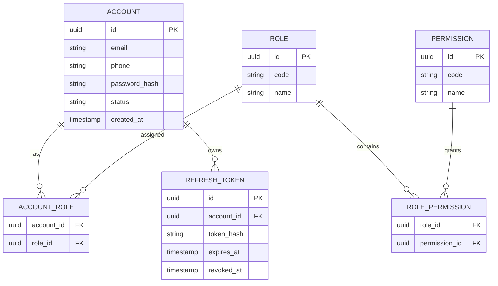

---

## 7.2. Customer Service — PostgreSQL

### Lý do chọn

Customer Profile là dữ liệu master, cần unique phone/email và cập nhật transaction rõ ràng.

### ERD

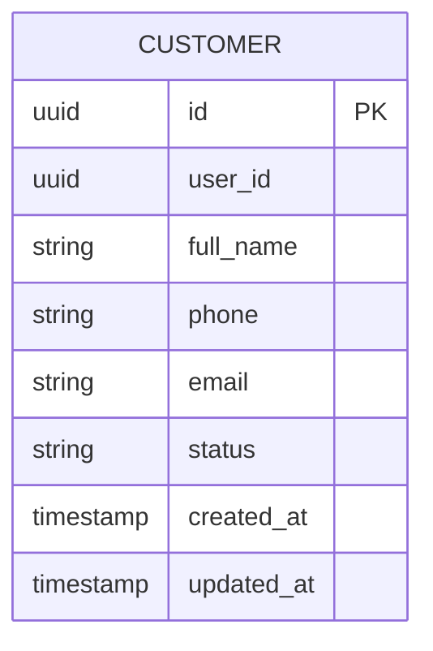

`user_id` tham chiếu logic sang Identity Service, **không tạo FK xuyên database**.

---

## 7.3. Driver Service — PostgreSQL

### Lý do chọn

Driver–License–Vehicle có quan hệ chặt, dữ liệu dài hạn và cần kiểm soát tính toàn vẹn.

### ERD

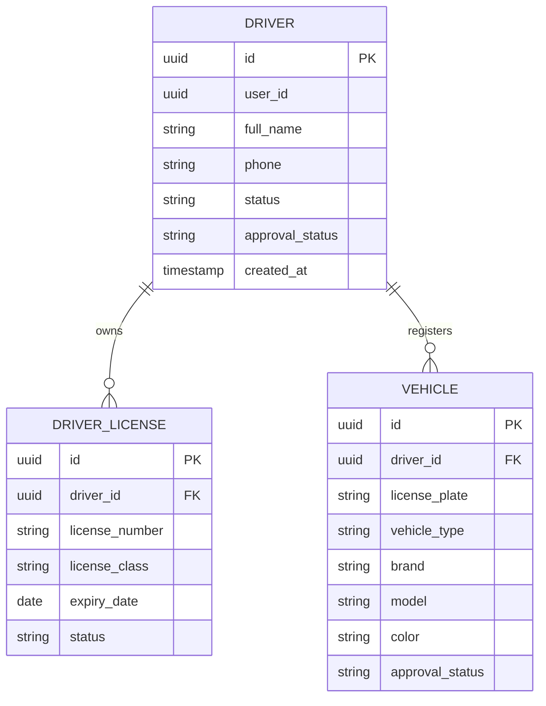

---

## 7.4. Trip Service — PostgreSQL

### Lý do chọn

Trip là Aggregate quan trọng nhất, có state transition, cần transaction và audit trạng thái.

### ERD

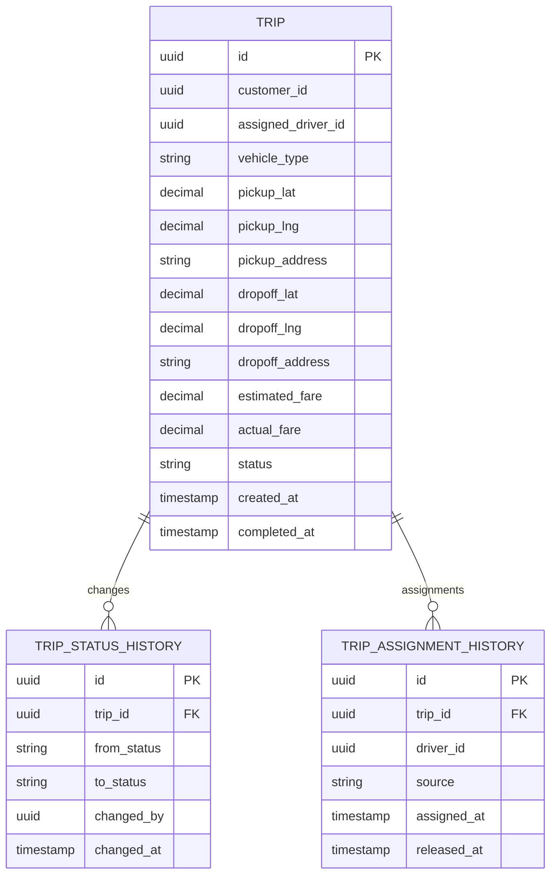

---

## 7.5. Dispatch Service — Redis

### Lý do chọn

Dispatch cần:

- GEO search cực nhanh;
- TTL;
- locking;
- candidate queue;
- trạng thái chỉ có giá trị trong thời gian ngắn;
- GPS cập nhật vài giây/lần.

Vì vậy Redis phù hợp hơn PostgreSQL/MongoDB làm datastore chính cho context này.

### Mô hình logic

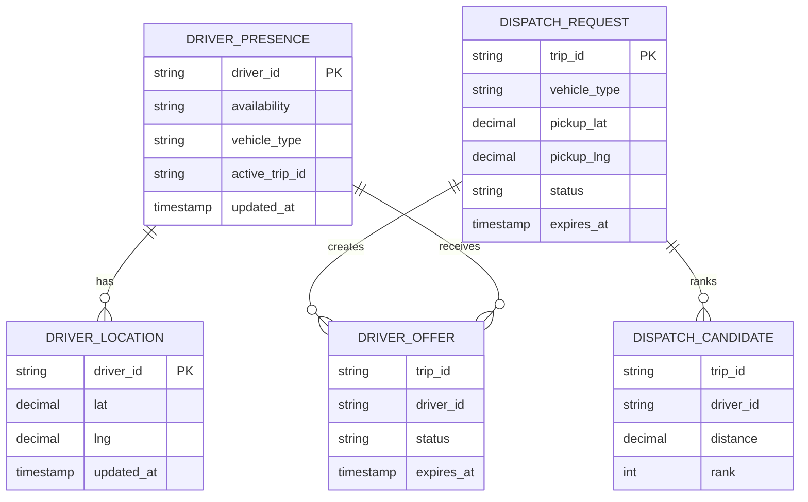

### Redis key design

| Key | Type | Ví dụ | TTL |
|---|---|---|---|
| `geo:drivers:available:{vehicleType}` | GEO/ZSET | `geo:drivers:available:CAR_4` | Không bắt buộc |
| `driver:presence:{driverId}` | HASH | availability, vehicle_type, active_trip_id | 30–60s heartbeat |
| `dispatch:{tripId}` | HASH | pickup, vehicle_type, status | 5–10 phút |
| `dispatch:candidates:{tripId}` | ZSET | driverId score=distance | Theo dispatch TTL |
| `offer:{tripId}:{driverId}` | HASH | status, sent_at | ~15s |
| `assignment-lock:{tripId}` | STRING | driverId | Cho đến khi assignment hoàn tất |

---

## 7.6. Pricing Service — PostgreSQL

### Lý do chọn

Fare Rule và Vehicle Type có phiên bản, thời gian hiệu lực, quan hệ và cần audit thay đổi.

### ERD

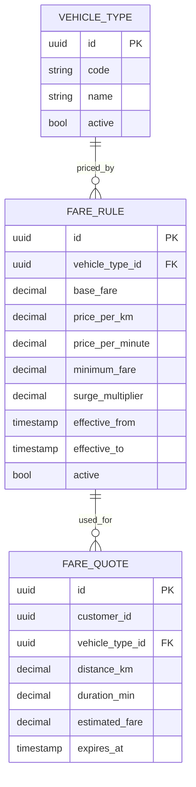

---

## 7.7. Payment Service — PostgreSQL

### Lý do chọn

Payment cần transaction, uniqueness, idempotency và đối soát chính xác.

### ERD

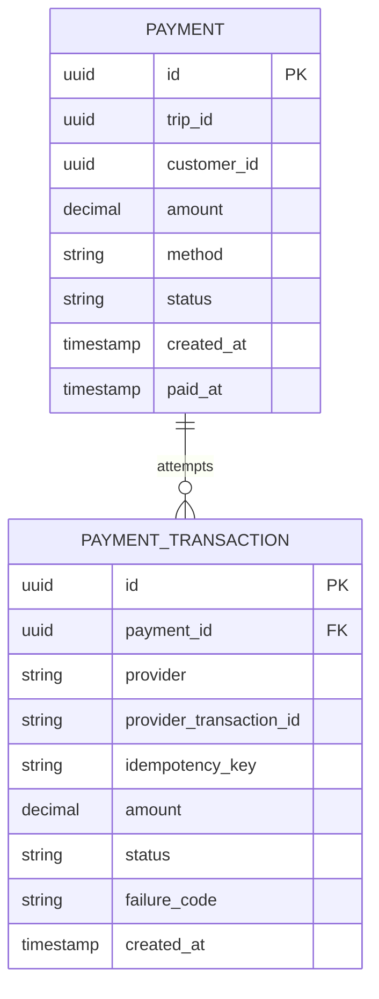

---

## 7.8. Notification Service — MongoDB

### Lý do chọn

Notification có payload khác nhau theo event/channel, lưu nhiều log gửi, lượng ghi/đọc lớn và schema có thể mở rộng. MongoDB phù hợp.

### Document model / ERD logic

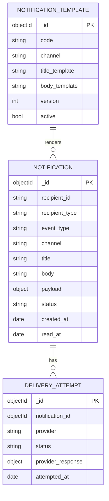

---

## 7.9. Review Service — PostgreSQL

### Lý do chọn

Mỗi Trip chỉ được review một lần; cần constraint unique và thống kê rating nhất quán.

### ERD

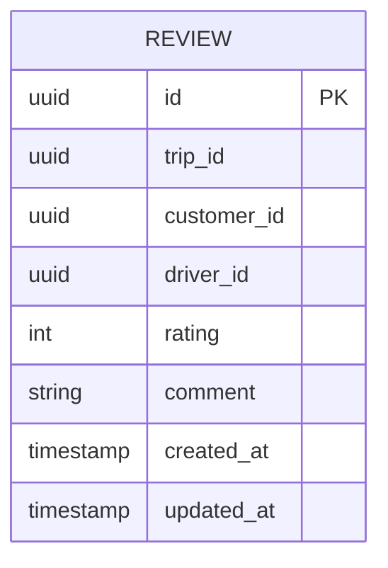

---

## 7.10. Operations Service — MongoDB

### Lý do chọn

Dashboard/report cần đọc nhanh, truy vấn nhiều chiều, dữ liệu được denormalize từ nhiều event và không phải source of truth. MongoDB phù hợp cho CQRS read model.

### Document model / ERD logic

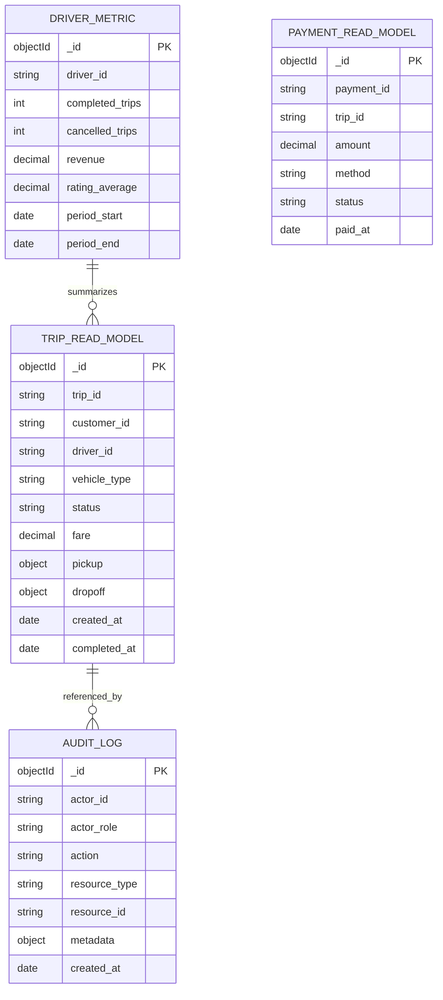

---

# 8. Xây dựng CSDL cho từng Microservice

> Các script dưới đây là baseline có thể đặt trong thư mục `database/` của từng service.

---

## 8.1. `identity-service` — PostgreSQL

```sql
CREATE EXTENSION IF NOT EXISTS pgcrypto;

CREATE TABLE accounts (
    id UUID PRIMARY KEY DEFAULT gen_random_uuid(),
    email VARCHAR(255) UNIQUE,
    phone VARCHAR(30) UNIQUE,
    password_hash TEXT NOT NULL,
    status VARCHAR(30) NOT NULL DEFAULT 'ACTIVE'
        CHECK (status IN ('ACTIVE', 'LOCKED', 'DISABLED')),
    created_at TIMESTAMPTZ NOT NULL DEFAULT now(),
    updated_at TIMESTAMPTZ NOT NULL DEFAULT now(),
    CHECK (email IS NOT NULL OR phone IS NOT NULL)
);

CREATE TABLE roles (
    id UUID PRIMARY KEY DEFAULT gen_random_uuid(),
    code VARCHAR(50) UNIQUE NOT NULL,
    name VARCHAR(100) NOT NULL
);

CREATE TABLE permissions (
    id UUID PRIMARY KEY DEFAULT gen_random_uuid(),
    code VARCHAR(100) UNIQUE NOT NULL,
    name VARCHAR(150) NOT NULL
);

CREATE TABLE account_roles (
    account_id UUID NOT NULL REFERENCES accounts(id) ON DELETE CASCADE,
    role_id UUID NOT NULL REFERENCES roles(id) ON DELETE CASCADE,
    PRIMARY KEY (account_id, role_id)
);

CREATE TABLE role_permissions (
    role_id UUID NOT NULL REFERENCES roles(id) ON DELETE CASCADE,
    permission_id UUID NOT NULL REFERENCES permissions(id) ON DELETE CASCADE,
    PRIMARY KEY (role_id, permission_id)
);

CREATE TABLE refresh_tokens (
    id UUID PRIMARY KEY DEFAULT gen_random_uuid(),
    account_id UUID NOT NULL REFERENCES accounts(id) ON DELETE CASCADE,
    token_hash TEXT UNIQUE NOT NULL,
    expires_at TIMESTAMPTZ NOT NULL,
    revoked_at TIMESTAMPTZ,
    created_at TIMESTAMPTZ NOT NULL DEFAULT now()
);

CREATE INDEX idx_refresh_tokens_account ON refresh_tokens(account_id);
CREATE INDEX idx_refresh_tokens_expire ON refresh_tokens(expires_at);

INSERT INTO roles(code, name) VALUES
('CUSTOMER', 'Customer'),
('DRIVER', 'Driver'),
('OPERATOR', 'Operation Staff'),
('SUPER_ADMIN', 'Super Administrator')
ON CONFLICT DO NOTHING;
```

---

## 8.2. `customer-service` — PostgreSQL

```sql
CREATE EXTENSION IF NOT EXISTS pgcrypto;

CREATE TABLE customers (
    id UUID PRIMARY KEY DEFAULT gen_random_uuid(),
    user_id UUID UNIQUE NOT NULL,
    full_name VARCHAR(150) NOT NULL,
    phone VARCHAR(30) UNIQUE NOT NULL,
    email VARCHAR(255) UNIQUE,
    status VARCHAR(30) NOT NULL DEFAULT 'ACTIVE'
        CHECK (status IN ('ACTIVE', 'BANNED', 'INACTIVE')),
    created_at TIMESTAMPTZ NOT NULL DEFAULT now(),
    updated_at TIMESTAMPTZ NOT NULL DEFAULT now()
);

CREATE INDEX idx_customers_phone ON customers(phone);
CREATE INDEX idx_customers_status ON customers(status);
CREATE INDEX idx_customers_full_name ON customers(full_name);
```

---

## 8.3. `driver-service` — PostgreSQL

```sql
CREATE EXTENSION IF NOT EXISTS pgcrypto;

CREATE TABLE drivers (
    id UUID PRIMARY KEY DEFAULT gen_random_uuid(),
    user_id UUID UNIQUE NOT NULL,
    full_name VARCHAR(150) NOT NULL,
    phone VARCHAR(30) UNIQUE NOT NULL,
    status VARCHAR(30) NOT NULL DEFAULT 'ACTIVE'
        CHECK (status IN ('ACTIVE', 'BANNED', 'INACTIVE')),
    approval_status VARCHAR(30) NOT NULL DEFAULT 'PENDING'
        CHECK (approval_status IN ('PENDING', 'APPROVED', 'REJECTED')),
    created_at TIMESTAMPTZ NOT NULL DEFAULT now(),
    updated_at TIMESTAMPTZ NOT NULL DEFAULT now()
);

CREATE TABLE driver_licenses (
    id UUID PRIMARY KEY DEFAULT gen_random_uuid(),
    driver_id UUID NOT NULL REFERENCES drivers(id) ON DELETE CASCADE,
    license_number VARCHAR(80) UNIQUE NOT NULL,
    license_class VARCHAR(30),
    issue_date DATE,
    expiry_date DATE,
    status VARCHAR(30) NOT NULL DEFAULT 'PENDING'
        CHECK (status IN ('PENDING', 'APPROVED', 'REJECTED', 'EXPIRED')),
    created_at TIMESTAMPTZ NOT NULL DEFAULT now()
);

CREATE TABLE vehicles (
    id UUID PRIMARY KEY DEFAULT gen_random_uuid(),
    driver_id UUID NOT NULL REFERENCES drivers(id) ON DELETE CASCADE,
    license_plate VARCHAR(30) UNIQUE NOT NULL,
    vehicle_type VARCHAR(30) NOT NULL
        CHECK (vehicle_type IN ('BIKE', 'CAR_4', 'CAR_7')),
    brand VARCHAR(80),
    model VARCHAR(80),
    color VARCHAR(50),
    approval_status VARCHAR(30) NOT NULL DEFAULT 'PENDING'
        CHECK (approval_status IN ('PENDING', 'APPROVED', 'REJECTED')),
    created_at TIMESTAMPTZ NOT NULL DEFAULT now(),
    updated_at TIMESTAMPTZ NOT NULL DEFAULT now()
);

CREATE INDEX idx_driver_approval ON drivers(approval_status);
CREATE INDEX idx_vehicle_driver ON vehicles(driver_id);
CREATE INDEX idx_vehicle_type_approval ON vehicles(vehicle_type, approval_status);
```

---

## 8.4. `trip-service` — PostgreSQL

```sql
CREATE EXTENSION IF NOT EXISTS pgcrypto;

CREATE TABLE trips (
    id UUID PRIMARY KEY DEFAULT gen_random_uuid(),

    -- ID ngoài bounded context: KHÔNG tạo FK xuyên service
    customer_id UUID NOT NULL,
    assigned_driver_id UUID,

    vehicle_type VARCHAR(30) NOT NULL
        CHECK (vehicle_type IN ('BIKE', 'CAR_4', 'CAR_7')),

    pickup_lat NUMERIC(10,7) NOT NULL,
    pickup_lng NUMERIC(10,7) NOT NULL,
    pickup_address TEXT,

    dropoff_lat NUMERIC(10,7) NOT NULL,
    dropoff_lng NUMERIC(10,7) NOT NULL,
    dropoff_address TEXT,

    estimated_fare NUMERIC(14,2),
    actual_fare NUMERIC(14,2),

    status VARCHAR(30) NOT NULL DEFAULT 'FINDING'
        CHECK (status IN (
            'FINDING',
            'ASSIGNED',
            'ARRIVED',
            'IN_PROGRESS',
            'COMPLETED',
            'CANCELLED'
        )),

    cancellation_reason TEXT,

    created_at TIMESTAMPTZ NOT NULL DEFAULT now(),
    assigned_at TIMESTAMPTZ,
    arrived_at TIMESTAMPTZ,
    started_at TIMESTAMPTZ,
    completed_at TIMESTAMPTZ,
    cancelled_at TIMESTAMPTZ,
    updated_at TIMESTAMPTZ NOT NULL DEFAULT now()
);

CREATE TABLE trip_status_history (
    id UUID PRIMARY KEY DEFAULT gen_random_uuid(),
    trip_id UUID NOT NULL REFERENCES trips(id) ON DELETE CASCADE,
    from_status VARCHAR(30),
    to_status VARCHAR(30) NOT NULL,
    changed_by UUID,
    changed_by_type VARCHAR(30),
    note TEXT,
    changed_at TIMESTAMPTZ NOT NULL DEFAULT now()
);

CREATE TABLE trip_assignment_history (
    id UUID PRIMARY KEY DEFAULT gen_random_uuid(),
    trip_id UUID NOT NULL REFERENCES trips(id) ON DELETE CASCADE,
    driver_id UUID NOT NULL,
    source VARCHAR(30) NOT NULL DEFAULT 'DISPATCH',
    assigned_at TIMESTAMPTZ NOT NULL DEFAULT now(),
    released_at TIMESTAMPTZ,
    release_reason TEXT
);

CREATE INDEX idx_trips_customer_created
    ON trips(customer_id, created_at DESC);

CREATE INDEX idx_trips_driver_created
    ON trips(assigned_driver_id, created_at DESC);

CREATE INDEX idx_trips_status
    ON trips(status);

CREATE INDEX idx_trip_history_trip
    ON trip_status_history(trip_id, changed_at);

CREATE INDEX idx_assignment_trip
    ON trip_assignment_history(trip_id, assigned_at);
```

---

## 8.5. `dispatch-service` — Redis

Redis không dùng `CREATE TABLE`. Thiết kế key và command baseline:

```redis
# 1. Tài xế Online và vị trí trong GEO index
GEOADD geo:drivers:available:CAR_4 106.700981 10.776889 driver-123

# 2. Presence + heartbeat
HSET driver:presence:driver-123 \
  availability AVAILABLE \
  vehicle_type CAR_4 \
  active_trip_id "" \
  updated_at 2026-09-23T12:00:00Z
EXPIRE driver:presence:driver-123 60

# 3. Tạo dispatch request
HSET dispatch:trip-001 \
  vehicle_type CAR_4 \
  pickup_lat 10.776889 \
  pickup_lng 106.700981 \
  status SEARCHING \
  current_candidate_index 0
EXPIRE dispatch:trip-001 600

# 4. Query tài xế gần khách
GEOSEARCH geo:drivers:available:CAR_4 \
  FROMLONLAT 106.700981 10.776889 \
  BYRADIUS 5 KM \
  ASC \
  COUNT 20 \
  WITHDIST

# 5. Danh sách candidate; score = distance
ZADD dispatch:candidates:trip-001 0.8 driver-123
ZADD dispatch:candidates:trip-001 1.4 driver-456
EXPIRE dispatch:candidates:trip-001 600

# 6. Offer cho tài xế, ví dụ 15 giây
HSET offer:trip-001:driver-123 \
  status PENDING \
  sent_at 2026-09-23T12:00:10Z
EXPIRE offer:trip-001:driver-123 15

# 7. Lock assignment nguyên tử
SET assignment-lock:trip-001 driver-123 NX EX 30

# 8. Khi driver đã nhận trip
HSET driver:presence:driver-123 \
  availability IN_TRIP \
  active_trip_id trip-001

ZREM geo:drivers:available:CAR_4 driver-123
```

### Pseudo Lua cho Accept

```lua
-- KEYS[1] = assignment-lock:{tripId}
-- ARGV[1] = driverId
-- Chỉ một driver có thể thắng

if redis.call("EXISTS", KEYS[1]) == 0 then
    redis.call("SET", KEYS[1], ARGV[1], "EX", 30)
    return 1
end

return 0
```

> Production có thể triển khai script Lua bằng `EVALSHA` để đảm bảo thao tác accept là atomic.

---

## 8.6. `pricing-service` — PostgreSQL

```sql
CREATE EXTENSION IF NOT EXISTS pgcrypto;

CREATE TABLE vehicle_types (
    id UUID PRIMARY KEY DEFAULT gen_random_uuid(),
    code VARCHAR(30) UNIQUE NOT NULL,
    name VARCHAR(100) NOT NULL,
    active BOOLEAN NOT NULL DEFAULT TRUE
);

CREATE TABLE fare_rules (
    id UUID PRIMARY KEY DEFAULT gen_random_uuid(),
    vehicle_type_id UUID NOT NULL REFERENCES vehicle_types(id),
    base_fare NUMERIC(14,2) NOT NULL DEFAULT 0,
    price_per_km NUMERIC(14,2) NOT NULL DEFAULT 0,
    price_per_minute NUMERIC(14,2) NOT NULL DEFAULT 0,
    minimum_fare NUMERIC(14,2) NOT NULL DEFAULT 0,
    surge_multiplier NUMERIC(8,3) NOT NULL DEFAULT 1,
    effective_from TIMESTAMPTZ NOT NULL,
    effective_to TIMESTAMPTZ,
    active BOOLEAN NOT NULL DEFAULT TRUE,
    created_at TIMESTAMPTZ NOT NULL DEFAULT now()
);

CREATE TABLE fare_quotes (
    id UUID PRIMARY KEY DEFAULT gen_random_uuid(),
    customer_id UUID,
    vehicle_type_id UUID NOT NULL REFERENCES vehicle_types(id),
    fare_rule_id UUID NOT NULL REFERENCES fare_rules(id),
    distance_km NUMERIC(10,3) NOT NULL,
    duration_min NUMERIC(10,2),
    estimated_fare NUMERIC(14,2) NOT NULL,
    expires_at TIMESTAMPTZ NOT NULL,
    created_at TIMESTAMPTZ NOT NULL DEFAULT now()
);

CREATE INDEX idx_fare_rule_lookup
    ON fare_rules(vehicle_type_id, active, effective_from);

CREATE INDEX idx_quote_expiry
    ON fare_quotes(expires_at);

INSERT INTO vehicle_types(code, name) VALUES
('BIKE', 'Xe máy'),
('CAR_4', 'Ô tô 4 chỗ'),
('CAR_7', 'Ô tô 7 chỗ')
ON CONFLICT DO NOTHING;
```

---

## 8.7. `payment-service` — PostgreSQL

```sql
CREATE EXTENSION IF NOT EXISTS pgcrypto;

CREATE TABLE payments (
    id UUID PRIMARY KEY DEFAULT gen_random_uuid(),

    -- cross-service references
    trip_id UUID UNIQUE NOT NULL,
    customer_id UUID NOT NULL,

    amount NUMERIC(14,2) NOT NULL CHECK (amount >= 0),
    method VARCHAR(30) NOT NULL
        CHECK (method IN ('CASH', 'E_WALLET', 'CARD')),
    status VARCHAR(30) NOT NULL DEFAULT 'PENDING'
        CHECK (status IN ('PENDING', 'PROCESSING', 'SUCCESS', 'FAILED')),

    created_at TIMESTAMPTZ NOT NULL DEFAULT now(),
    paid_at TIMESTAMPTZ,
    updated_at TIMESTAMPTZ NOT NULL DEFAULT now()
);

CREATE TABLE payment_transactions (
    id UUID PRIMARY KEY DEFAULT gen_random_uuid(),
    payment_id UUID NOT NULL REFERENCES payments(id) ON DELETE CASCADE,
    provider VARCHAR(100),
    provider_transaction_id VARCHAR(255),
    idempotency_key VARCHAR(255) UNIQUE NOT NULL,
    amount NUMERIC(14,2) NOT NULL,
    status VARCHAR(30) NOT NULL
        CHECK (status IN ('PENDING', 'PROCESSING', 'SUCCESS', 'FAILED')),
    failure_code VARCHAR(100),
    failure_message TEXT,
    provider_payload JSONB,
    created_at TIMESTAMPTZ NOT NULL DEFAULT now(),
    completed_at TIMESTAMPTZ
);

CREATE INDEX idx_payment_status
    ON payments(status, created_at DESC);

CREATE INDEX idx_payment_customer
    ON payments(customer_id, created_at DESC);

CREATE INDEX idx_transaction_payment
    ON payment_transactions(payment_id, created_at DESC);

CREATE INDEX idx_provider_txn
    ON payment_transactions(provider_transaction_id);
```

---

## 8.8. `notification-service` — MongoDB

```javascript
use cab_notification;

db.createCollection("notification_templates", {
  validator: {
    $jsonSchema: {
      bsonType: "object",
      required: ["code", "channel", "bodyTemplate", "version", "active"],
      properties: {
        code: { bsonType: "string" },
        channel: {
          enum: ["IN_APP", "PUSH", "SMS", "EMAIL"]
        },
        titleTemplate: { bsonType: ["string", "null"] },
        bodyTemplate: { bsonType: "string" },
        version: { bsonType: "int" },
        active: { bsonType: "bool" },
        createdAt: { bsonType: "date" }
      }
    }
  }
});

db.notification_templates.createIndex(
  { code: 1, channel: 1, version: 1 },
  { unique: true }
);

db.createCollection("notifications", {
  validator: {
    $jsonSchema: {
      bsonType: "object",
      required: [
        "recipientId",
        "recipientType",
        "eventType",
        "channel",
        "body",
        "status",
        "createdAt"
      ],
      properties: {
        recipientId: { bsonType: "string" },
        recipientType: { enum: ["CUSTOMER", "DRIVER", "ADMIN"] },
        eventType: { bsonType: "string" },
        channel: { enum: ["IN_APP", "PUSH", "SMS", "EMAIL"] },
        title: { bsonType: ["string", "null"] },
        body: { bsonType: "string" },
        payload: { bsonType: "object" },
        status: {
          enum: ["PENDING", "SENT", "DELIVERED", "FAILED"]
        },
        createdAt: { bsonType: "date" },
        readAt: { bsonType: ["date", "null"] }
      }
    }
  }
});

db.notifications.createIndex({
  recipientId: 1,
  createdAt: -1
});

db.notifications.createIndex({
  status: 1,
  createdAt: 1
});

db.createCollection("delivery_attempts");

db.delivery_attempts.createIndex({
  notificationId: 1,
  attemptedAt: -1
});

db.delivery_attempts.createIndex({
  status: 1,
  attemptedAt: 1
});
```

### Ví dụ document

```javascript
db.notifications.insertOne({
  recipientId: "customer-001",
  recipientType: "CUSTOMER",
  eventType: "DRIVER_ASSIGNED",
  channel: "IN_APP",
  title: "Đã tìm thấy tài xế",
  body: "Tài xế đang di chuyển đến điểm đón.",
  payload: {
    tripId: "trip-001",
    driverId: "driver-123"
  },
  status: "SENT",
  createdAt: new Date(),
  readAt: null
});
```

---

## 8.9. `review-service` — PostgreSQL

```sql
CREATE EXTENSION IF NOT EXISTS pgcrypto;

CREATE TABLE reviews (
    id UUID PRIMARY KEY DEFAULT gen_random_uuid(),

    -- cross-service references
    trip_id UUID UNIQUE NOT NULL,
    customer_id UUID NOT NULL,
    driver_id UUID NOT NULL,

    rating SMALLINT NOT NULL CHECK (rating BETWEEN 1 AND 5),
    comment TEXT,

    created_at TIMESTAMPTZ NOT NULL DEFAULT now(),
    updated_at TIMESTAMPTZ NOT NULL DEFAULT now()
);

CREATE INDEX idx_reviews_driver_created
    ON reviews(driver_id, created_at DESC);

CREATE INDEX idx_reviews_customer
    ON reviews(customer_id, created_at DESC);

CREATE VIEW driver_rating_summary AS
SELECT
    driver_id,
    COUNT(*) AS review_count,
    ROUND(AVG(rating)::numeric, 2) AS average_rating
FROM reviews
GROUP BY driver_id;
```

---

## 8.10. `operations-service` — MongoDB

```javascript
use cab_operations;

db.createCollection("trip_read_models");
db.trip_read_models.createIndex({ tripId: 1 }, { unique: true });
db.trip_read_models.createIndex({ status: 1, createdAt: -1 });
db.trip_read_models.createIndex({ driverId: 1, createdAt: -1 });
db.trip_read_models.createIndex({ customerId: 1, createdAt: -1 });
db.trip_read_models.createIndex({ completedAt: -1 });

db.createCollection("payment_read_models");
db.payment_read_models.createIndex({ paymentId: 1 }, { unique: true });
db.payment_read_models.createIndex({ tripId: 1 });
db.payment_read_models.createIndex({ status: 1, paidAt: -1 });
db.payment_read_models.createIndex({ method: 1, paidAt: -1 });

db.createCollection("driver_metrics");
db.driver_metrics.createIndex(
  { driverId: 1, periodStart: 1, periodEnd: 1 },
  { unique: true }
);

db.createCollection("audit_logs", {
  validator: {
    $jsonSchema: {
      bsonType: "object",
      required: [
        "actorId",
        "actorRole",
        "action",
        "resourceType",
        "createdAt"
      ],
      properties: {
        actorId: { bsonType: "string" },
        actorRole: { bsonType: "string" },
        action: { bsonType: "string" },
        resourceType: { bsonType: "string" },
        resourceId: { bsonType: ["string", "null"] },
        metadata: { bsonType: "object" },
        createdAt: { bsonType: "date" }
      }
    }
  }
});

db.audit_logs.createIndex({ createdAt: -1 });
db.audit_logs.createIndex({
  actorId: 1,
  createdAt: -1
});
db.audit_logs.createIndex({
  resourceType: 1,
  resourceId: 1,
  createdAt: -1
});
```

### Ví dụ Trip Read Model

```javascript
db.trip_read_models.insertOne({
  tripId: "trip-001",
  customerId: "customer-001",
  driverId: "driver-123",
  vehicleType: "CAR_4",
  status: "COMPLETED",
  estimatedFare: 85000,
  actualFare: 91000,
  pickup: {
    address: "Điểm A",
    lat: 10.776889,
    lng: 106.700981
  },
  dropoff: {
    address: "Điểm B",
    lat: 10.801234,
    lng: 106.712345
  },
  createdAt: new Date("2026-09-23T12:00:00Z"),
  completedAt: new Date("2026-09-23T12:30:00Z")
});
```

---

# 9. Domain Event giữa các Microservice

Các event đề xuất:

| Event | Producer | Consumer chính | Ý nghĩa |
|---|---|---|---|
| `CustomerCreated` | Customer | Operations | Tạo read model/customer metric nếu cần |
| `DriverApproved` | Driver | Dispatch, Operations | Tài xế đủ điều kiện vận hành |
| `VehicleApproved` | Driver | Dispatch, Operations | Phương tiện đủ điều kiện |
| `DriverOnline` | Dispatch | Operations | Cập nhật dashboard |
| `DriverLocationUpdated` | Dispatch | Operations/WebSocket Gateway | Realtime tracking |
| `TripCreated` | Trip | Dispatch, Notification, Operations | Khởi động tìm tài xế |
| `DispatchRequested` | Trip | Dispatch | Bắt đầu matching |
| `DriverOfferCreated` | Dispatch | Notification | Gửi offer cho tài xế |
| `DriverOfferRejected` | Dispatch | Operations | Theo dõi dispatch |
| `DriverAssigned` | Dispatch | Trip, Notification, Operations | Gán tài xế |
| `DispatchFailed` | Dispatch | Trip, Notification, Operations | Không tìm được tài xế |
| `DriverArrived` | Trip | Notification, Operations | Đã đến điểm đón |
| `TripStarted` | Trip | Operations | Bắt đầu thực hiện chuyến |
| `TripCompleted` | Trip | Pricing, Payment, Notification, Operations | Kết thúc hành trình |
| `FareFinalized` | Pricing | Trip, Payment, Operations | Cước cuối đã chốt |
| `PaymentSucceeded` | Payment | Notification, Operations, Review | Thanh toán thành công |
| `PaymentFailed` | Payment | Notification, Operations | Giao dịch lỗi |
| `ReviewSubmitted` | Review | Operations | Cập nhật driver metric |
| `AdminInterventionRecorded` | Operations | Trip/Notification khi cần | Can thiệp vận hành |

## 9.1. Event Envelope chuẩn

```json
{
  "eventId": "uuid",
  "eventType": "TripCompleted",
  "eventVersion": 1,
  "occurredAt": "2026-09-23T12:30:00Z",
  "source": "trip-service",
  "correlationId": "trip-001",
  "data": {
    "tripId": "trip-001",
    "customerId": "customer-001",
    "driverId": "driver-123"
  }
}
```

## 9.2. Khuyến nghị reliability

Đối với PostgreSQL service nên dùng **Transactional Outbox Pattern**:

1. Update aggregate.
2. Insert event vào `outbox_events` trong cùng transaction.
3. Background publisher đọc outbox.
4. Publish sang Kafka/RabbitMQ.
5. Đánh dấu event đã publish.

Baseline table:

```sql
CREATE TABLE outbox_events (
    id UUID PRIMARY KEY,
    aggregate_type VARCHAR(100) NOT NULL,
    aggregate_id UUID NOT NULL,
    event_type VARCHAR(150) NOT NULL,
    payload JSONB NOT NULL,
    occurred_at TIMESTAMPTZ NOT NULL DEFAULT now(),
    published_at TIMESTAMPTZ
);

CREATE INDEX idx_outbox_unpublished
ON outbox_events(occurred_at)
WHERE published_at IS NULL;
```

---

# 10. Traceability FR → Bounded Context → Microservice

## 10.1. Customer App

| FR | Chức năng | Bounded Context / Service |
|---|---|---|
| FR-CUS-01 | Đăng ký / Đăng nhập | BC-01 Identity |
| FR-CUS-02 | Quản lý hồ sơ | BC-02 Customer |
| FR-CUS-03 | Chọn điểm đón/đến | BC-04 Trip |
| FR-CUS-04 | Chọn loại xe & xem giá | BC-06 Pricing + BC-04 Trip |
| FR-CUS-05 | Tracking real-time | BC-05 Dispatch + BC-04 Trip |
| FR-CUS-06 | Chọn phương thức thanh toán | BC-07 Payment |
| FR-CUS-07 | Lịch sử chuyến | BC-04 Trip |
| FR-CUS-08 | Đánh giá & phản hồi | BC-09 Review |

## 10.2. Driver App

| FR | Chức năng | Bounded Context / Service |
|---|---|---|
| FR-DRV-01 | Đăng nhập & Hồ sơ | BC-01 Identity + BC-03 Driver |
| FR-DRV-02 | Bật/Tắt hoạt động | BC-05 Dispatch |
| FR-DRV-03 | Nhận chuyến | BC-05 Dispatch |
| FR-DRV-04 | Cập nhật trạng thái chuyến | BC-04 Trip |
| FR-DRV-05 | GPS Background | BC-05 Dispatch |

## 10.3. Core Backend

| FR | Chức năng | Bounded Context / Service |
|---|---|---|
| FR-SYS-01 | Dispatching | BC-05 Dispatch |
| FR-SYS-02 | Dispatch retry | BC-05 Dispatch |
| FR-SYS-03 | Dispatch timeout | BC-05 Dispatch + BC-08 Notification |
| FR-SYS-04 | Tính cước cuối | BC-06 Pricing |
| FR-SYS-05 | Cổng thanh toán | BC-07 Payment |
| FR-SYS-06 | Engine thông báo | BC-08 Notification |

## 10.4. Admin Portal

| FR | Chức năng | Bounded Context / Service |
|---|---|---|
| FR-ADM-01 | Quản lý User/Driver/Vehicle | BC-01 + BC-02 + BC-03 |
| FR-ADM-02 | Dashboard giám sát | BC-10 Operations, nhận event từ BC-04/05 |
| FR-ADM-03 | Tra cứu & đối soát | BC-10 Operations + BC-07 Payment |
| FR-ADM-04 | RBAC | BC-01 Identity |
| FR-ADM-05 | Báo cáo | BC-10 Operations |
| FR-ADM-06 | System/Audit Log | BC-10 Operations |

---

# 11. Đề xuất cấu trúc source code

```text
CAB-SYSTEM/
├── services/
│   ├── identity-service/
│   │   ├── src/
│   │   │   ├── domain/
│   │   │   ├── application/
│   │   │   ├── infrastructure/
│   │   │   └── api/
│   │   └── database/
│   │       └── init.sql
│   │
│   ├── customer-service/
│   │   └── database/init.sql
│   │
│   ├── driver-service/
│   │   └── database/init.sql
│   │
│   ├── trip-service/
│   │   └── database/init.sql
│   │
│   ├── dispatch-service/
│   │   └── database/
│   │       └── redis-key-design.md
│   │
│   ├── pricing-service/
│   │   └── database/init.sql
│   │
│   ├── payment-service/
│   │   └── database/init.sql
│   │
│   ├── notification-service/
│   │   └── database/init.mongodb.js
│   │
│   ├── review-service/
│   │   └── database/init.sql
│   │
│   └── operations-service/
│       └── database/init.mongodb.js
│
├── docs/
│   ├── Micro_service_design.md
│   ├── context-map.md
│   └── api/
│
├── docker-compose.yml
└── README.md
```

## 11.1. Kiến trúc bên trong một service

Ví dụ `trip-service`:

```text
trip-service/
├── src/
│   ├── domain/
│   │   ├── entities/
│   │   │   └── Trip
│   │   ├── value-objects/
│   │   │   ├── Location
│   │   │   └── Money
│   │   ├── events/
│   │   │   ├── TripCreated
│   │   │   └── TripCompleted
│   │   ├── repositories/
│   │   │   └── TripRepository
│   │   └── services/
│   │
│   ├── application/
│   │   ├── commands/
│   │   ├── queries/
│   │   └── handlers/
│   │
│   ├── infrastructure/
│   │   ├── persistence/
│   │   ├── messaging/
│   │   └── clients/
│   │
│   └── api/
│       ├── controllers/
│       └── dto/
│
└── database/
    └── init.sql
```

---

# 12. Kết luận

Thiết kế cuối cùng gồm **10 Bounded Context / 10 Microservice**:

1. `identity-service` — PostgreSQL
2. `customer-service` — PostgreSQL
3. `driver-service` — PostgreSQL
4. `trip-service` — PostgreSQL
5. `dispatch-service` — Redis
6. `pricing-service` — PostgreSQL
7. `payment-service` — PostgreSQL
8. `notification-service` — MongoDB
9. `review-service` — PostgreSQL
10. `operations-service` — MongoDB

### Lựa chọn database

- **PostgreSQL:** Identity, Customer, Driver, Trip, Pricing, Payment, Review — vì dữ liệu có quan hệ chặt, cần transaction/constraint và tồn tại lâu dài.
- **Redis:** Dispatch — vì cần geospatial lookup, TTL, lock nguyên tử và dữ liệu vị trí/offer có vòng đời rất ngắn.
- **MongoDB:** Notification và Operations/Reporting — vì dữ liệu document linh hoạt, read-heavy, denormalized, khối lượng log/event lớn.

### Nguyên tắc quan trọng nhất

Mỗi Microservice **sở hữu dữ liệu của chính nó**. Không có một database CAB chung và không tạo foreign key xuyên service. Tính nhất quán giữa các Bounded Context được xử lý qua REST command và Domain Event.

Thiết kế này trực tiếp hỗ trợ các yêu cầu NFR của bài toán: mở rộng độc lập, cô lập lỗi, dễ bổ sung phương thức thanh toán/kênh thông báo và triển khai chức năng từng phần.
